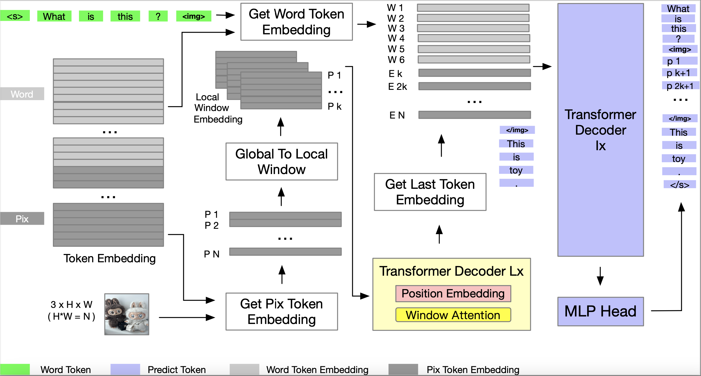
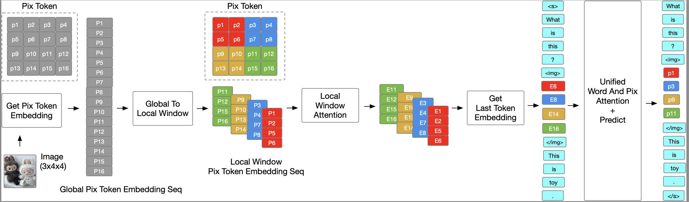
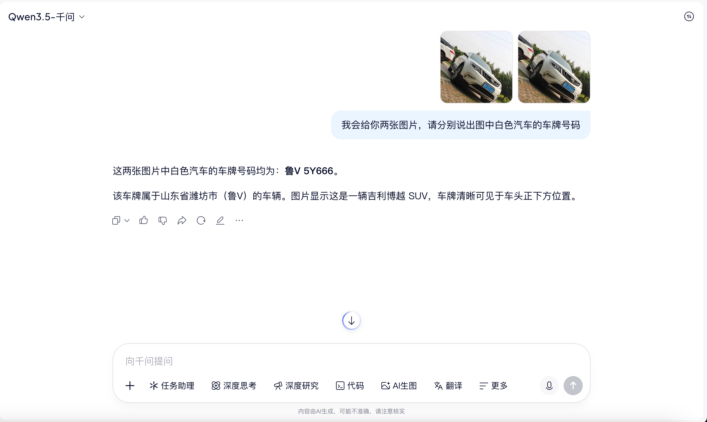
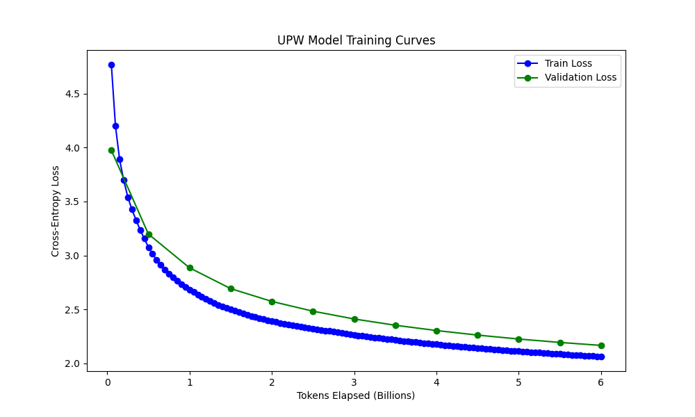
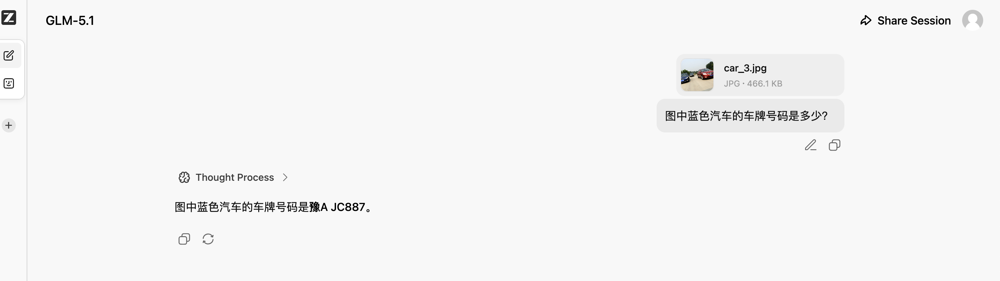
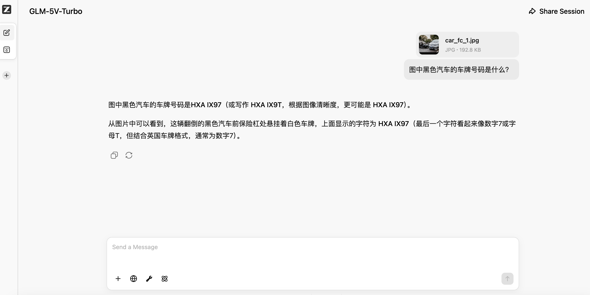
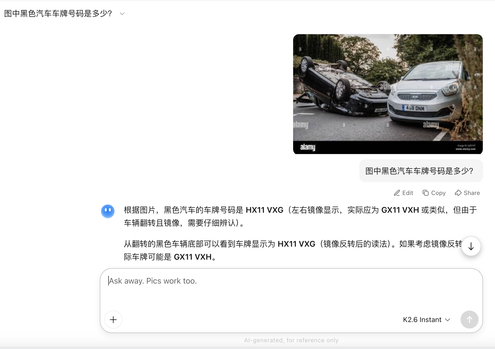
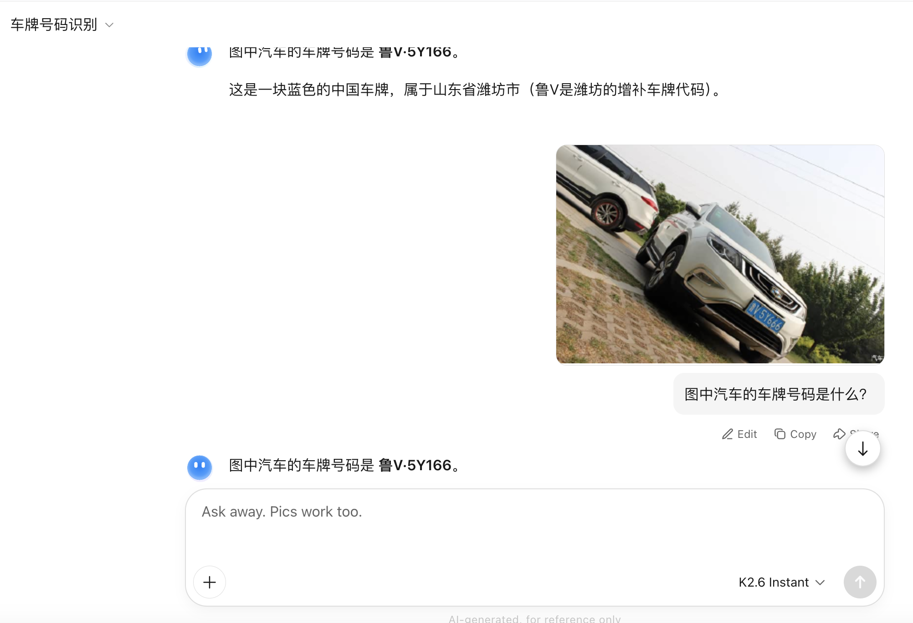
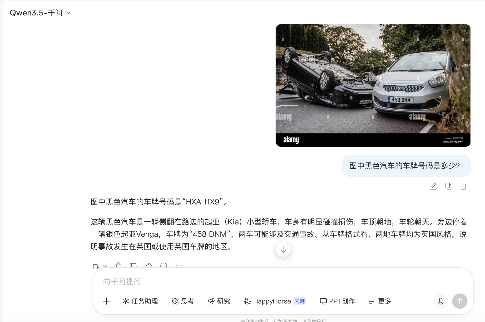
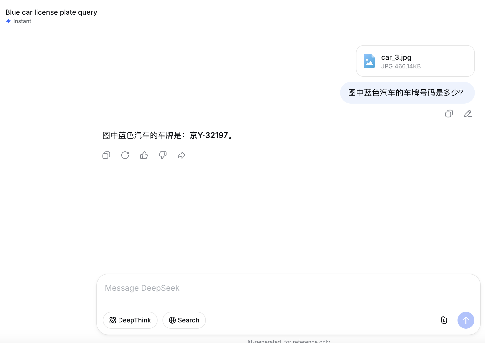

# UPW (UNIFIED PIX TOKEN AND WORD TOKEN GENERATIVE LANGUAGE MODEL)
Our goal is to solve the limitation of visual understanding in the current state-of-art open source multimodal generative language model. This code repository is an experiment to demonstrate the unified pix token and word token generative language model proposed in the paper [UNIFIED PIX TOKEN AND WORD TOKEN GENERATIVE LANGUAGE MODEL](https://arxiv.org/abs/2605.14028). User can conducte image unsupervised pretraining experiments that include [mixed image and text](#mixed-image-and-text-unsupervised-pretraining) or [image only](#image-only-unsupervised-pretraining).

## Paper Abstract
Since the emergence of Vision Transformer (ViT), it has been widely used in generative language model and generative visual model. Especially in the current state-of-art open source multimodal models, ViT obtained by CLIP or SigLIP method serves as the vision encoder backbone to help them acquire visual understanding capabilities. But this method leads to limitations in visual understanding for details, such as difficulty in recognizing small text or numbers in images. To address these [issues](#current-issues), we propose a new model to unify pix token and word token into the generative language model. The new model also features with each pix of image having its own token embedding, color folding, global conditional attention approximation and image unsupervised pretraining.

* Unified Pix Token And Word Token Model overview.


* Unified Pix Token And Word Token Model Process.


## Current issues
The widely used open-source multimodal large language models currently suffer from the limitation of visual understanding. There may be difficulties in understanding the details in the image, such as recognizing small text or numbers; either there may be problems with understanding the images in multiple rounds of conversations, with the initial conversation being understood correctly and the subsequent conversations being misunderstood. 

For example, almost all open-source models have error in identifying license plate number of car. 

[See more error examples](#error-examples). 

(NOTE: The test images used in the error examples are located in our code repository ['problem/image'](problem/image/README.md) directory.)

## Paper research
We first analyzed the reasons for the limitations of current state-of-art open source generative language models in visual understanding. Then we propose a new model to solve this issues: Unified pix token and word token generative language model. Our model finally unifies pix token and word token together. In the unified token space, we can do self attention operation and token predict for both pix token and word token. The new model also features with each pix of image having its own token embedding, color folding, global conditional attention approximation and image unsupervised pretraining. We conducted only image unsupervised pretraining experiments using our model. The experimental results have proven that after a certain amount of data pretraining, our small parammters model can learn the patterns of the pix token sequence. We believe that when we increase the number of parameters and datas, our model also conforms to the scaling law of generative language model. The new model we proposed is a perfect way to unify pix token and word token together into generative language model. We believe it can replace the CLIP/SLIP method currently used in production.

## Experiment How to
Due to a lack of computing resources, our experiment was conducted on low-end GPU devices (16G memory). So it has to rely on flash-attention-turing. And the model parameters is small (Image Only 120M, Mixed Image And Text 170M) due to out of memory. But it is sufficient to prove the conclusion of the paper.

### Install dependencies
(NOTE: Change "/path/to/" that appears below to your local path.)
* install flash-attention-turing  
```python
	git clone https://github.com/ssiu/flash-attention-turing
	cd /path/to/flash-attention-turing
	pip install torch setuptools ninja wheel
	pip install -v . 
```

* install flash_attention_interface  
The install package is in our code repository ["src/flash_attn_api"](src/flash_attn_api/README.md) directory.
```python
	cd /path/to/upw/src/flash_attn_api
	pip install setuptools
	python setup.py install
```

* install tokenizers  
Need a higher version, for example version 0.22.2.
```python
pip install tokenizers
```

* install torch  
You must ensure that torch is installed, for example version 2.10.0+cu128.

### Image Only Unsupervised Pretraining
* prepare training data  
You can use any image dataset. We support images of any ratio. In paper we use the images of LLaVA-CC3M-Pretrain-595K dataset. You should put the images in a directory. For example: /path/to/image.
```python 
mkdir /path/to/image
cd /path/to/image
wget https://huggingface.co/datasets/liuhaotian/LLaVA-CC3M-Pretrain-595K/blob/main/images.zip
unzip images.zip
```

* run training  
We run the script to conducte image only unsupervised pretraining. For example we use 120000 images to train.
```python
cd /path/to/upw/src/model
!python train_model.py /path/to/image -l 120000 --imageonly
```

* training curves  
This is the training curve we obtained.


### Mixed Image And Text Unsupervised Pretraining
* training data format  
The text file contains sentence paragraphs and image references. And request to image referenced using <|image|> and <|/image|> special tokens. For example: 
```python
Provide a brief description of the given image. <|image|>GCC_train_002582585.jpg<|/image|> olive oil is a healthy ingredient used liberally .
```
See more examples in our code repository ["src/mixed_files"](src/mixed_files/README.md) directory.

* prepare training data  
Prepare the text files according to the format and put them in a directory. For example: /path/to/mixed_files. Put the images referenced in another directory. For example: /path/to/image.

* run training  
We run the script to conducte mixed image and text unsupervised pretraining. For example we use 120000 mixed files to train.
```python
cd /path/to/upw/src/model
!python train_model.py /path/to/mixed_files -l 120000 -i /path/to/image
```

## Contact
If you have any questions, please feel free to submit a GitHub issue or contact haunleung@outlook.com.

## Citation
If you find our code and models useful, please kindly cite the following information.

```python
@misc{leung2026unifiedpixtokenword,
      title={Unified Pix Token And Word Token Generative Language Model}, 
      author={Haun Leung and ZiNan Wang},
      year={2026},
      eprint={2605.14028},
      archivePrefix={arXiv},
      primaryClass={cs.CV},
      url={https://arxiv.org/abs/2605.14028}, 
}
```

## Error examples
Almost all open-source models fail in identifying license plate number of car.
* GLM-5.1 or GLM-5V-Turbo



* KIMI-2.6-Instant



* Qwen-3.5



* DeepSeek


